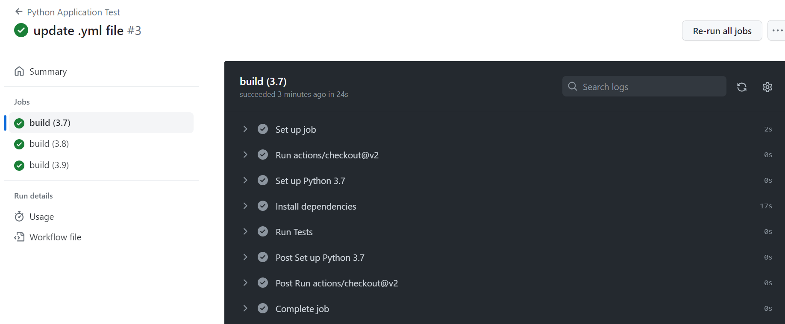

# Python Calculator with GitHub Actions

This repository showcases a simple Python calculator module and its unit tests, executed across multiple Python versions using GitHub Actions.

## Python Module: Calculator

The calculator module (`calculator.py`) includes basic arithmetic operations:

- Addition
- Subtraction
- Multiplication
- Division

## Unit Tests

Tests for the calculator module can be found in the file `test_calculator.py`. The tests cover all the basic operations ensuring the correctness of the calculator functionality.

### Test Results

Here's a snippet of the test results when executed locally:

Ran 4 tests in 0.000s

OK

## GitHub Actions Workflow

The workflow tests the calculator module across three different Python versions:

- Python 3.7
- Python 3.8
- Python 3.9

A matrix strategy is used in the GitHub Actions configuration to ensure tests are executed for each of the specified Python versions.

## Learnings

Through this project, I've acquired a deep understanding of:

1. **Unit Testing**: The importance of writing unit tests to validate the correctness of code.
2. **Continuous Integration**: Utilizing GitHub Actions as a CI tool to automatically run tests in different environments.
3. **Matrix Builds**: Testing code across multiple Python versions to ensure compatibility and robustness.
